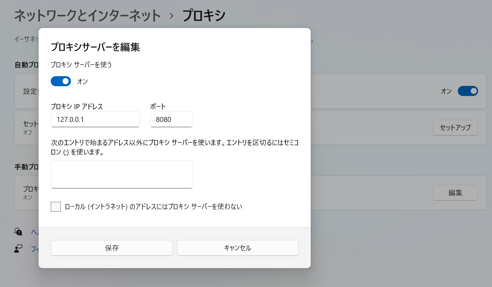

# cgss-api-dumper
cgss-api-dumper はデレステの通信内容を解析する mitmproxy 用 Python スクリプトです

## 必要なもの
- Python 3
- DMM版アイドルマスターシンデレラガールズスターライトステージ

## 使用方法
- 必要なパッケージをインストール

```console
$ pip install -r requirements.txt
```

- mitmproxy を `cgss_script.py` を読み込み指定して起動

```console
$ mitmdump -s cgss_script.py
```

- Windows の プロキシ設定から「プロキシサーバーを使う」のセットアップを開く


- 「プロキシサーバーを使う」をオンにし、「プロキシIPアドレス」に `127.0.0.1` を、「ポート」に `8080` を入力し保存



- http://mitm.it にアクセスし、Windows 用の証明書をダウンロード


- 手順に従い、証明書をコンピュータにインストールする


- DMM版アイドルマスターシンデレラガールズスターライトステージを起動


- APIサーバとの通信が行われたらリクエストとレスポンスがコンソールに表示される

